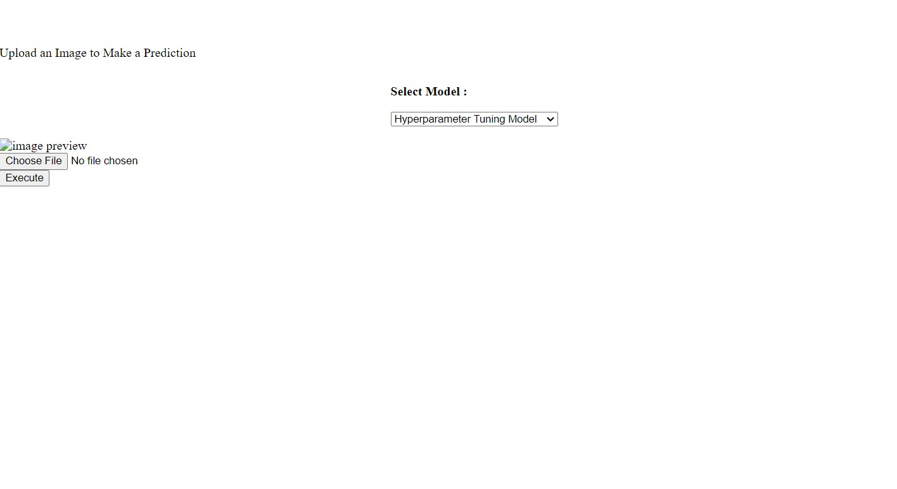
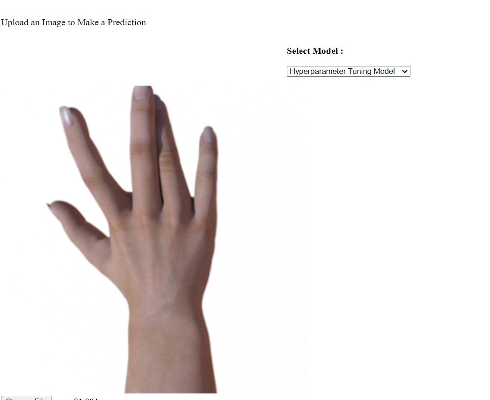
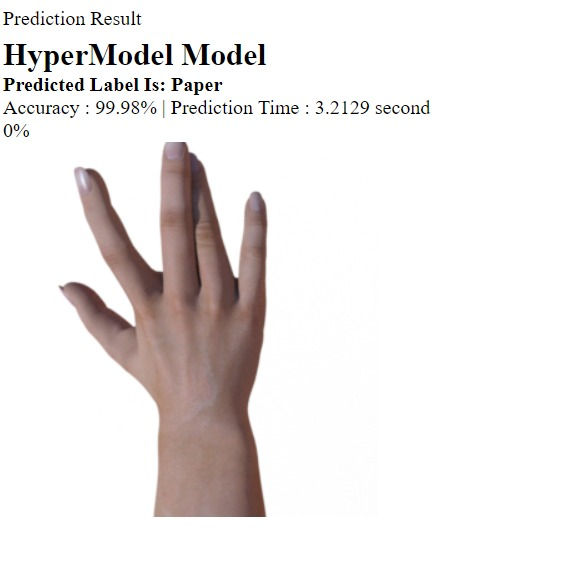

# Modul-6

# Rock-Paper-Scissors Simple Prediction App

Aplikasi web sederhana yang menggunakan model pembelajaran mendalam yang telah dilatih sebelumnya untuk memprediksi apakah gambar yang diunggah berisi batu, kertas, atau gunting.

# Dataset: RPS

- **ROCK**
- **PAPER**
- **SCISSORS**

Model di train menggunakan Transfer Learning EfficientNetV2B0 dilakukan dengan 10 epochs serta penerapan data augmentation.

**EfficientNetV2B0:**
EfficientNetV2 adalah serangkaian arsitektur jaringan saraf yang dikembangkan oleh Google yang diperkenalkan sebagai evolusi dari EfficientNet. Versi EfficientNetV2B0 adalah model yang lebih kecil dari serangkaian tersebut. Model ini menggunakan teknik optimasi yang inovatif untuk mencapai tingkat kinerja yang baik dengan jumlah parameter yang lebih sedikit dibandingkan dengan arsitektur lainnya.

